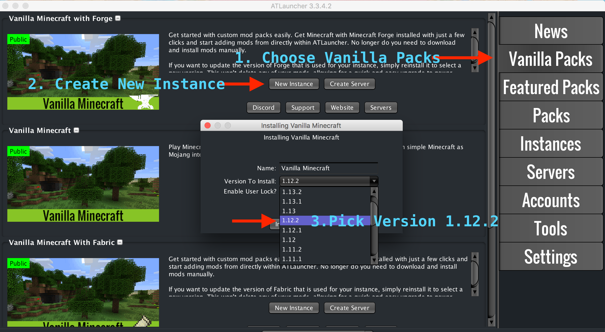
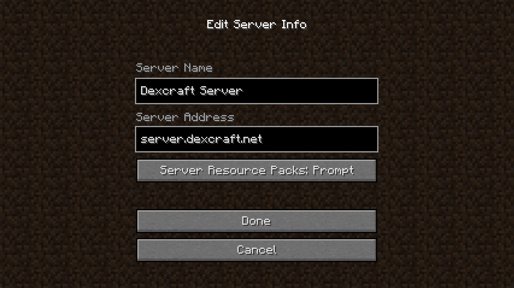

# Dexcraft

Dexter's Minecraft server

## Installing Minecraft

You will need the java version of Minecraft at version 1.12.2.

We recommend using [ATLauncher](https://atlauncher.com/downloads).

Once you have installed ATLauncher you will need to install the correct Minecraft version.

 

You will need to be whitelisted in order to access the server, so _just ask Dexter_.

## Using the Server

The server is accessible at [server.dexcraft.net](server.dexcraft.net).

When you start Minecraft, click "Multiplayer", "Add Server" and use these details:

 

## Troubleshooting

Ask Robert.