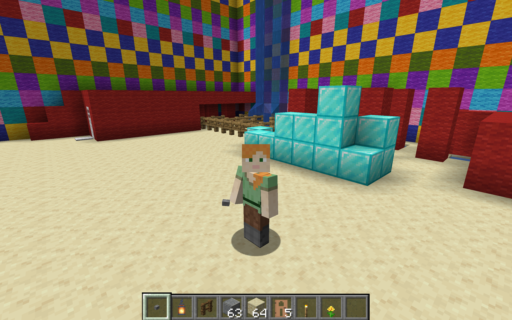

## Dexcraft

Welcome to Dexter's Minecraft server!

 

To get access you will need to give Dexter your Minecraft username to be added to the server.

### Times to play

The server is online between **4:30pm to 5:30pm Saturday and Sunday**.

At other times the server will automatically switch itself off!

## Installing Minecraft

You will need the latest **java version** of Minecraft. Unfortunately this isn't compatible with the tablet, phone or console versions.

You can install it from [minecraft.net](https://www.minecraft.net/en-us/download).

## Using the Server

The server is accessible at [server.dexcraft.net](server.dexcraft.net).

When you start Minecraft, click "Multiplayer", "Add Server" and use these details:

 

You will need to be whitelisted in order to access the server, so _just ask Dexter_.

## Troubleshooting

Ask Robert.
